 

 

## ABOUT

> CSE & Data Science student building practical systems with **AI, data, web technologies and cybersecurity**.
> I like turning ideas into working projects and learning by building.

 

## TECH STACK

 

## CURRENT SIGNAL

 

 

 

 

