```html
<p align="center">
  
</p>

<p align="center">
  
</p>

<p align="center">
  
  
  
</p>

---

<h2 align="center">ABOUT</h2>

<p align="center">
  <b>B.Tech CSE (Data Science)</b><br>
  NMIMS MPSTME, Shirpur
</p>

<p align="center">
  I’m interested in the intersection of <b>Artificial Intelligence</b>,
  <b>Data Science</b> and <b>Cybersecurity</b>.
  <br><br>
  I enjoy solving problems, experimenting with technology,
  analysing patterns and turning ideas into practical systems.
</p>

---

<h2 align="center">TECH STACK</h2>

<p align="center">
  
</p>

<p align="center">
  
</p>

<p align="center">
  
</p>

<p align="center">
  
</p>

<p align="center">
  <sub>
    C • C++ • Java • Python • JavaScript • TensorFlow • OpenCV •
    HTML • CSS • React • Node.js • Express • Flutter • MongoDB • Git
  </sub>
</p>

---

<h2 align="center">CURRENT STATE</h2>

<p align="center">
  
</p>

<table align="center">
<tr>
<td>

```text
AI / ML          ███████████████░░░  exploring
DATA SCIENCE     ██████████████░░░░  building
CYBERSECURITY    ████████████░░░░░░  learning
DSA              ████████████████░░  practising
DEVELOPMENT      ██████████████░░░░  experimenting
```

</td>
</tr>
</table>

---

<h2 align="center">DSA</h2>

<p align="center">
  
</p>

<p align="center">
  <code>LeetCode → Java</code>
  &nbsp;&nbsp;•&nbsp;&nbsp;
  <code>GeeksforGeeks → C</code>
  &nbsp;&nbsp;•&nbsp;&nbsp;
  <code>CodeChef → Python</code>
</p>

<p align="center">
  <a href="https://github.com/Adix10/DSA-Coding-Practice">
    
  </a>
</p>

---

<h2 align="center">ACTIVITY MATRIX</h2>

<p align="center">
  
</p>

<p align="center">
  <sub>
    CONTRIBUTION DATA • CODE ACTIVITY • CONTINUOUS LEARNING
  </sub>
</p>

---

<h2 align="center">CONNECT</h2>

<p align="center">
  <a href="https://github.com/Adix10">
    
  </a>
  &nbsp;&nbsp;&nbsp;&nbsp;
  <a href="https://www.linkedin.com/">
    
  </a>
</p>

<p align="center">
  <code>connection.established()</code>
</p>

---

<p align="center">
  <sub>BUILD • LEARN • ANALYZE • SECURE • REPEAT</sub>
</p>
```

### Then save it

In Notepad:

**Ctrl + S**

Your repo should now contain:

```text
Adix10
│
├── README.md
│
└── assets
    ├── cyber-header.svg
    └── activity-matrix.svg
```

After saving, **don't push yet**. Next we'll check the Git changes and commit both SVG assets + the README together.